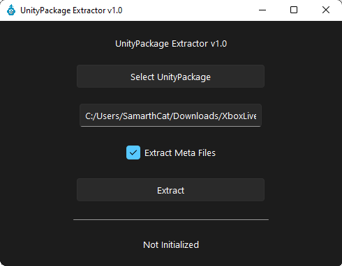
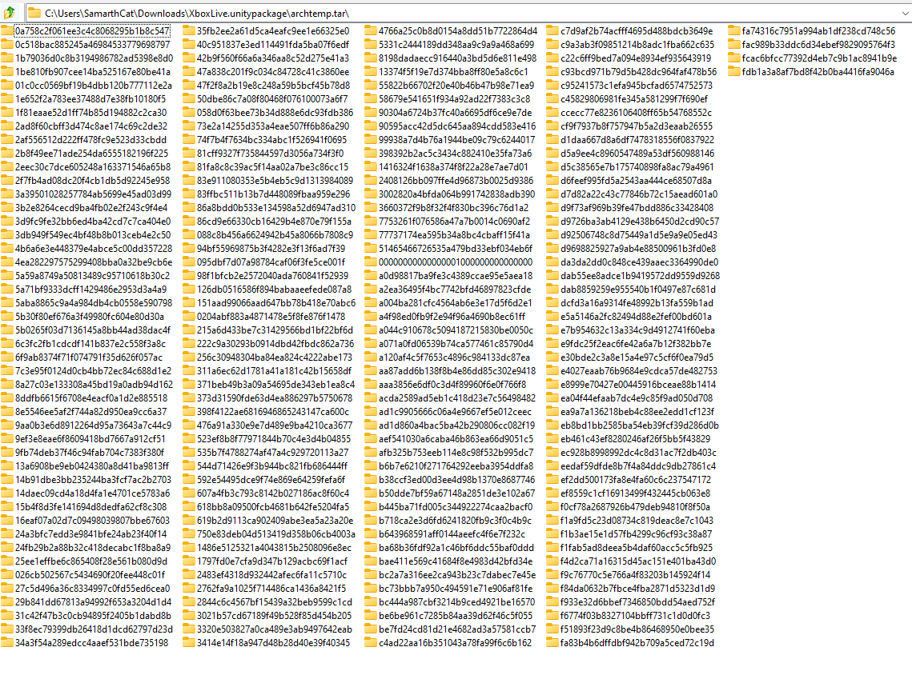

# UnityPackage Extractor
- A GUI and CLI Tool For Extracting UnityPackage Files.
- Works On All Platforms
- Can Extract Meta Files

# Usage
- Python is not required to run on windows  
- Download The Latest Release and run unityextract.exe  
- Click "Select UnityPackage" and Find Your UnityPackage
- Click "Extract"
- Once Complete, The Extracted Folder Will Be In The Same Folder As The Package

# Running On Mac or Linux
- Python is required (Tested with 3.9 and 3.10)
- Download the source code
- pip3 install -r requirements.txt
- python3 main.py

# CLI Usage
CLI mode does not work with prebuilt binaries, you have to run through python.  
Example:  
```
python3 main.py "C:\Users\BlahBlah\MyPackage.unitypackage" --extractmeta
```
CLI mode does not extract meta files by default, you'll have to use the --extractmeta switch if you want to include them.

# How Does It Work?  
This section may be useful for some of you if you want to implement the program in another language.  

basically, unitypackage files are actually tar.gz archives.  
If you open one up in an unarchiver, you'll see a bunch of gibberish folders.  



Each of these folders is a different asset, named according to its GUID.  
Inside these folders, you will see 2-4 files, depending on the type of asset.   
Here is a table of the files in these folders:  
| File Name   | Presence                        | Description                                                                 | Example Contents                                                                                                                                                                                       |   |
|-------------|---------------------------------|-----------------------------------------------------------------------------|--------------------------------------------------------------------------------------------------------------------------------------------------------------------------------------------------------|---|
| asset       | Only If The Asset Is A File     | Contains The Raw File For An Asset                                          | using System; using UnityEngine; ...                                                                                                                                                                   |   |
| asset.meta  | Always                          | The Meta File For Its Corresponding Asset                                   | fileFormatVersion: 2 guid: 0a758c2f061ee3c4c8068295b1b8c547 timeCreated: 1578438110 licenseType: Free TextScriptImporter:   externalObjects: {}   userData:    assetBundleName:    assetBundleVariant: |   |
| pathname    | Always                          | The File Containing The Path Of The Asset Relative To The Project Directory | Assets/My Asset/Scripts/Test.cs                                                                                                                                                                        |   |
| preview.png | Only If The File Is Previewable | The Icon For An Asset                                                       | ‰PNG      IHDR         óÿa   èIDAT8Ë¥’1 Â@Eç:^! ZÙ ...                                                                                                                                                 |   |

To extract an asset, all you have to do is move the "asset" file to the path found in "pathname".  
Remember, it's a relative path, so you have to add it on to an existing path.  
If you wish, you can also move the meta file too.  

In some cases, the "pathname" file will have multiple lines.
The path will always be the first line, so make sure you grab that and not the entire file.

If there is no "asset" file present, you can assume that the file is a folder and just move the meta file.